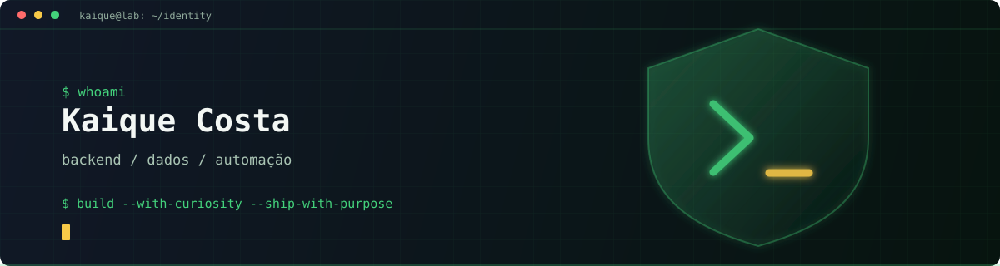

<div align="center">



### Construo minha base em tecnologia transformando curiosidade em prática.

**Desenvolvimento Backend • Dados • Automação**

<p>
  <a href="https://github.com/Kaiquey">
     
  </a>
  <a href="https://br.linkedin.com/in/kaique-costa-40181522a">
    
  </a>
  
</p>
</div>

---

## O que você vai encontrar aqui

Este perfil registra uma construção em andamento: fundamentos bem feitos, projetos que saem do papel e decisões técnicas que fazem sentido para o problema.

Meu ponto de partida é a Ciência da Computação. Hoje, concentro meu desenvolvimento em **Java, backend, SQL e automação**. Gosto de entender o caminho completo de uma solução: como a lógica é pensada, como os dados são organizados e como um processo pode se tornar mais simples e confiável.

Não uso este espaço para parecer pronto. Uso para tornar visível o processo, os aprendizados e a evolução.

## Minha direção

```text
┌──────────────────────────────┐
│     CIÊNCIA DA COMPUTAÇÃO    │
│       base para decidir      │
└───────────────┬──────────────┘
                │
                ▼
┌──────────────────────────────┐
│       DESENVOLVIMENTO        │
│      Java • C • lógica       │
└───────────────┬──────────────┘
                │
                ▼
┌──────────────────────────────┐
│           BACKEND            │
│        APIs • sistemas       │
└───────────────┬──────────────┘
                │
                ▼
┌──────────────────────────────┐
│       DADOS & DATABASE        │
│       SQL • modelagem        │
└───────────────┬──────────────┘
                │
                ▼
┌──────────────────────────────┐
│          AUTOMAÇÃO           │
│     processos • dados        │
└───────────────┬──────────────┘
                │
                ▼
┌──────────────────────────────┐
│        CYBERSECURITY         │
│     próxima direção          │
└──────────────────────────────┘
```
## Como estou construindo

Cada projeto é um laboratório: começo pelo fundamento, organizo o problema, implemento uma solução e observo o que precisa ser melhorado. Este GitHub reúne projetos acadêmicos, exercícios e experimentos feitos para transformar estudo em repertório prático.

| Frente | O que estou praticando |
| --- | --- |
| ☕ **Java** | Backend e orientação a objetos |
| 🔵 **C** | Fundamentos, memória e estruturas de dados |
| 🗄️ **SQL** | Modelagem, consultas e persistência |
| 🧠 **Algoritmos** | Lógica e resolução de problemas |
| 🌐 **Backend** | APIs e sistemas |
| ⚙️ **Automação** | Processos e gerenciamento de dados |
| 🔧 **Git/GitHub** | Versionamento e colaboração |
| 🔐 **Cybersecurity** | Fundamentos para uma próxima etapa |

## Progresso atual

### Fundamentos

* [x] Técnico em Desenvolvimento de Sistemas
* [x] Projetos em desenvolvimento
* [x] Git e GitHub
* [x] Fundamentos de desenvolvimento Web
* [x] Estrutura de Dados
* [x] Algoritmos

### Backend

* [x] Programação Orientada a Objetos
* [ ] Aprofundar Java
* [ ] APIs REST
* [ ] Spring Boot
* [ ] Arquitetura de aplicações
* [ ] Testes automatizados

### Dados

* [x] SQL
* [x] Modelagem de Banco de Dados
* [ ] PostgreSQL
* [ ] Persistência de dados
* [ ] Integração Backend + Banco de Dados

### Automação

* [ ] Processamento de arquivos
* [ ] Manipulação de dados
* [ ] Automação de tarefas
* [ ] Integração entre sistemas
* [ ] Processamento em lote

### Segurança

* [ ] Secure Coding
* [ ] Segurança de APIs
* [ ] Application Security
* [ ] Segurança de Dados
* [ ] DevSecOps


## Certificações

**Cybersecurity**

* **Introduction to Cybersecurity** - Cisco Networking Academy
* **Fortinet Certified Associate Cybersecurity** - Fortinet
* **FortiGate 7.6 Operator** - Fortinet

**Metodologias**
* **Scrum Fundamentals Certified** - SCRUMstudy

## Atividade

<div align="center">


</div>

