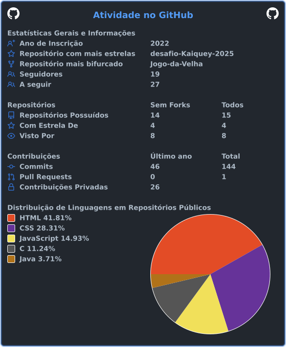

<div align="center">
## Olá, eu sou Kaique Costa

### Desenvolvedor de Software em formação **Backend * Java * Dados * Automação**

<p>
  <a href="https://github.com/Kaiquey">
     
  </a>
  <a href="https://br.linkedin.com/in/kaique-costa-40181522a">
    
  </a>
  
</p>
</div>

___

## Foco de Desenvolvimento

Minha carreira está sendo construída de forma progressiva:
```text
┌──────────────────────────────┐
│     CIÊNCIA DA COMPUTAÇÃO    │
│          Fundamentos         │
└───────────────┬──────────────┘
                │
                ▼
┌──────────────────────────────┐
│       DESENVOLVIMENTO        │
│        Java • C • Lógica     │
└───────────────┬──────────────┘
                │
                ▼
┌──────────────────────────────┐
│           BACKEND            │
│        APIs • Sistemas       │
└───────────────┬──────────────┘
                │
                ▼
┌──────────────────────────────┐
│       DADOS & DATABASE       │
│        SQL • Modelagem       │
└───────────────┬──────────────┘
                │
                ▼
┌──────────────────────────────┐
│          AUTOMAÇÃO           │
│     Processos • Dados        │
└───────────────┬──────────────┘
                │
                ▼
┌──────────────────────────────┐
│        CYBERSECURITY         │
│        Direção futura        │
└──────────────────────────────┘
```
## Projetos

Este GitHub representa minha evolução prática durante a formação em tecnologia e carreira.

Reunindo projetos acadêmicos, exercícios, experimentos e aplicações desenvolvidas para colocar em prática os conhecimentos adquiridos.

## Roadmap estruturado separado por área - direcionamento e o que já estou aplicando:

| Área                 | Direcionamento                            |
| -------------------- | ----------------------------------------- |
| ☕ **Java**           | Backend e Programação Orientada a Objetos |
| 🔵 **C**             | Fundamentos e estruturas de dados         |
| 🗄️ **SQL**          | Banco de dados e persistência             |
| 🧠 **Algoritmos**    | Lógica e resolução de problemas           |
| 🌐 **Backend**       | APIs e sistemas                           |
| ⚙️ **Automação**     | Processos e gerenciamento de dados        |
| 🔧 **Git/GitHub**    | Versionamento e colaboração               |
| 🔐 **Cybersecurity** | Fundamentos e preparação futura           |


## Fundamentos

* [x] Técnico em Desenvolvimento de Sistemas
* [x] Projetos em desenvolvimento
* [x] Git e GitHub
* [x] Fundamentos de desenvolvimento Web
* [x] Estrutura de Dados
* [x] Algoritmos

## Backend

* [x] Programação Orientada a Objetos
* [ ] Aprofundar Java
* [ ] APIs REST
* [ ] Spring Boot
* [ ] Arquitetura de aplicações
* [ ] Testes automatizados

## Dados

* [x] SQL
* [x] Modelagem de Banco de Dados
* [ ] PostgreSQL
* [ ] Persistência de dados
* [ ] Integração Backend + Banco de Dados

## Automação

* [ ] Processamento de arquivos
* [ ] Manipulação de dados
* [ ] Automação de tarefas
* [ ] Integração entre sistemas
* [ ] Processamento em lote

## Segurança

* [ ] Secure Coding
* [ ] Segurança de APIs
* [ ] Application Security
* [ ] Segurança de Dados
* [ ] DevSecOps


## Certificações

**Cybersecurity**

* **Introduction to Cybersecurity** - Cisco Networking Academy
* **Fortinet Certified Associate Cybersecurity** - Fortinet
* **FortiGate 7.6 Operator** - Fortinet

**Metodologias**
* **Scrum Fundamentals Certified** - SCRUMstudy

## 📊 GitHub Stats

<div align="center">




</div>

